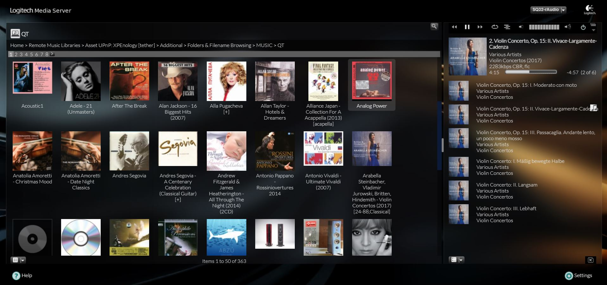
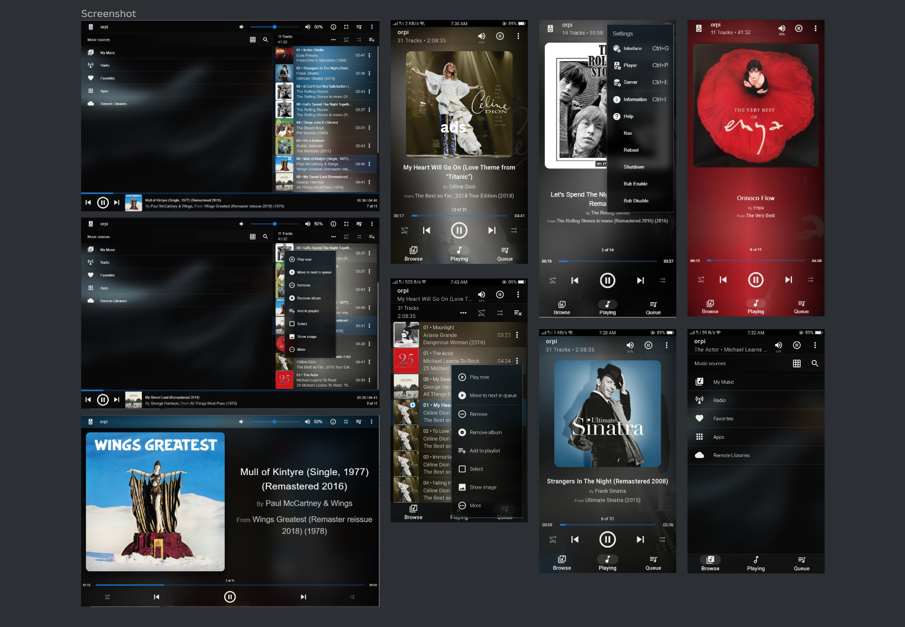
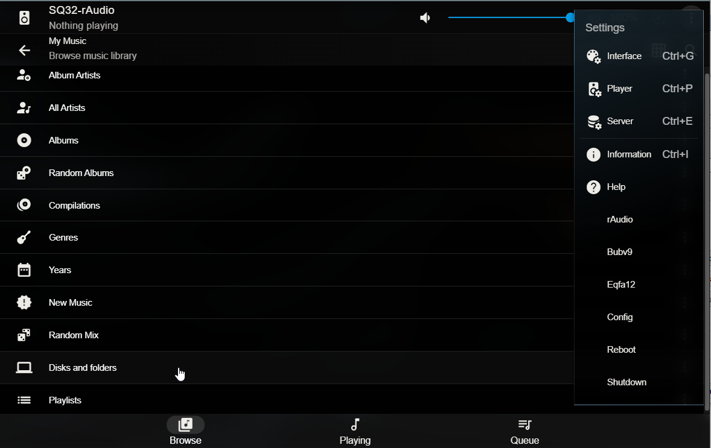

**How to create a perfect and feature-rich Music Server-Player (Software)** with a user-friendly, easy-to-use, visually appealing interface, coupled with outstanding sound quality on your Raspberry Pi?
Choose rAudio on the Arch Linux platform and LMS (Material Skin) to turn this into a reality. (Pi 2, Pi 3, and Pi 4).


# Build LMS-rAudio for Pi 2 and Pi 3

This guide explains how to build LMS-rAudio for Raspberry Pi 2 and Pi 3. Follow the steps below to set up LMS-rAudio.

## Instructions

1. **Flash rAudio IMG:**
   Flash the rAudio IMG to your memory card
>
> rAudio-RPi2-####img.xz (for Pi 2, Pi 3)
>
> rAudio-64bit-####.img.xz for Pi 4.
>
> https://github.com/rern/rAudio
>
> https://github.com/rern/rAudio/releases
>
-------------------
#### Here are the steps to connect to your Pi using SSH (with rAudio) via Putty
- Open Putty on your computer.
- In the "Host Name (or IP address)" field, enter the IP address of your Raspberry Pi or the hostname "raudio.local".
- For the username, enter: root
- For the password, enter: ros
- Press Enter after providing the login credentials.
- You should now be connected to your Raspberry Pi via SSH (port 22) using rAudio as the root user.
- Copy each of the following commands and paste them into Putty SSH, then press Enter.
[Putty screenshot](https://raw.githubusercontent.com/lovehifi/build-lms-sq-raudio/main/putty_config.png)
-------------
2. **Install script LMS and Squeezelite (32bit):**
   ```bash
   wget -O - https://raw.githubusercontent.com/lovehifi/raudiolms-32bit/main/install-archlinux.sh | sh

3. **Update script LMS and Squeezelite (32bit):**
   ```bash
   wget -O - https://raw.githubusercontent.com/lovehifi/raudiolms-32bit/main/update | sh

4. **Tidal Connect for rAudio:**
   ```bash
   wget -O - https://raw.githubusercontent.com/lovehifi/tidal-raudio/main/install.sh | sh

5. **Activate Material Skin Plugin:**
   To activate the Material Skin plugin, follow these steps:
   - Open LMS at http://ip:9000 or http://raudio:9000
   - Navigate to the menu: Server > Basic Settings > Plugins
   - Activate the Material Skin plugin

6. **BubLMSV9 (Connect to BubbleUPnP Server):**
   ```bash
   wget -O - https://raw.githubusercontent.com/lovehifi/lmsbub9/main/install.sh | sh

7. **Material Skin Mod:**
   ```bash
   wget -O- https://raw.githubusercontent.com/lovehifi/picoreaddon/main/mskin | sudo sh

8. **12-band [Parametric EQ Eqfa12](https://github.com/lovehifi/eqfa12) LMS:**
   ```bash
   wget -O - https://raw.githubusercontent.com/lovehifi/addraudio/main/eqfa12lms32 | sh

9. **Configure GUI LMS:**
   ```bash
   wget -O - https://raw.githubusercontent.com/lovehifi/addraudio/main/configgui | sh
--------------------
# Build LMS-rAudio (64 bit) for Pi 4

This guide explains how to build LMS-rAudio for Raspberry Pi 2 and Pi 3. Follow the steps below to set up LMS-rAudio.

## Instructions

1. **Flash rAudio IMG:**
   Flash the rAudio IMG to your memory card.
>
> https://github.com/rern/rAudio
>
> https://github.com/rern/rAudio/releases
>
-------------------
#### Here are the steps to connect to your Pi using SSH (with rAudio) via Putty
- Open Putty on your computer.
- In the "Host Name (or IP address)" field, enter the IP address of your Raspberry Pi or the hostname "raudio.local".
- For the username, enter: root
- For the password, enter: ros
- Press Enter after providing the login credentials.
- You should now be connected to your Raspberry Pi via SSH using rAudio as the root user.
- Copy each of the following commands and paste them into Putty SSH, then press Enter.
-------------
2. **Install script LMS and Squeezelite (64bit):**
   ```bash
   wget -O - https://raw.githubusercontent.com/lovehifi/raudiolms-32bit/main/install-archlinux.sh | sh

3. **Update script LMS and Squeezelite (64bit):**
   ```bash
   wget -O - https://raw.githubusercontent.com/lovehifi/raudiolms-64bit/main/update | sh

4. **Tidal Connect for rAudio:**
   ```bash
   wget -O - https://raw.githubusercontent.com/lovehifi/tidal-raudio-pi4/main/install | sh
   wget -O - https://raw.githubusercontent.com/lovehifi/tidal-raudio-pi4/main/update | sh

5. **Activate Material Skin Plugin:**
   To activate the Material Skin plugin, follow these steps:
   - Open LMS at http://ip:9000 or http://raudio:9000
   - Navigate to the menu: Server > Basic Settings > Plugins
   - Activate the Material Skin plugin

6. **BubLMSV9 (Connect to BubbleUPnP Server):**
   ```bash
   wget -O - https://raw.githubusercontent.com/lovehifi/lmsbub9/main/install.sh | sh

7. **Material Skin Mod:**
   ```bash
   wget -O- https://raw.githubusercontent.com/lovehifi/picoreaddon/main/mskin | sudo sh

8. **12-band [Parametric EQ Eqfa12](https://github.com/lovehifi/eqfa12) LMS:**
   ```bash
   wget -O - https://raw.githubusercontent.com/lovehifi/addraudio/main/eqfa12lms | sh

9. **Configure GUI LMS:**
   ```bash
   wget -O - https://raw.githubusercontent.com/lovehifi/addraudio/main/configgui | sh


------------------
>

>

>

>

>
--------------
>
## Why rAudio‐LMS?
>
See this link: https://github.com/lovehifi/raudiolms-32bit/wiki/Why-rAudio%E2%80%90LMS%3F
>
---------------------


